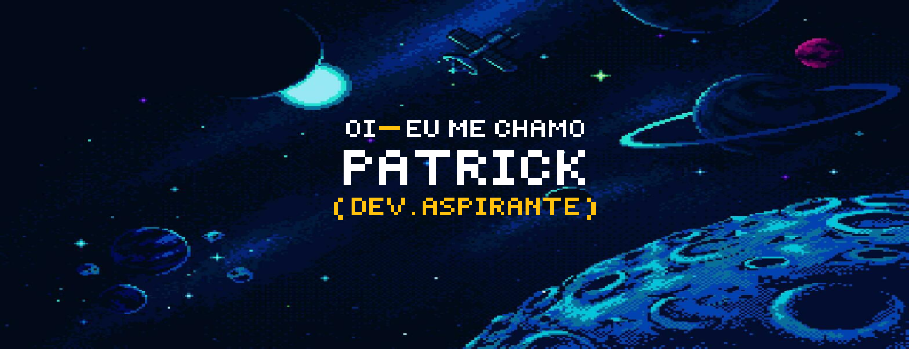

<!-- Bem-vindo ao edit do meu README! Este README foi inspirado em alguns perfis, sendo o principal que eu mais me inspirei foi o de https://github.com/ritik307! -->

 

<h1 >um pouco sobre mim...  </h1> 

 Olá! Como já dá para ver, eu me chamo Patrick, possuo atualmente 19 anos e sou estudante de Ciência da Computação na Unisul (2ª fase) 🎓 e também um protótipo de pessoa autodidata. Estou me direcionando para desenvolvimento web — <b>possivelmente full-stack</b> — e já tenho base em Java, Python, HTML, CSS e JavaScript; sigo me aprofundando e experimentando. Meu objetivo é me tornar alguém que realmente dominou a área — aprender tudo que for possível e ir além ✨. Fora do código, curto jogar e ler novels 🎮📚. Sempre em aprendizado e disposto a trocar ideia com quem também está na caminhada 👨‍💻 

<h2 align="center">meus conhecimentos </h2>

<h2 align="center">
  gráfico de contribuição 
</h2>

  

<h2 align="center">
  meus status
</h2>
 
 

 

 
